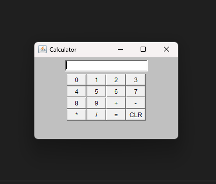

# Calculator Java Program By Muzamil
<a href="musaibgashru.co"> musaibgashru.co </a>

## Overview
This repository contains a simple calculator program implemented in Java. The calculator provides basic arithmetic operations such as addition, subtraction, multiplication, and division. The graphical user interface (GUI) is built using Java AWT and handles user input through buttons.
- **Java**: The programming language used to develop the calculator.
- **AWT (Abstract Window Toolkit)**: The Java package used for creating the graphical user interface.




## How to Run the Calculator
Follow these steps to run the calculator program:

### Prerequisites
- Make sure you have Java installed on your system.

### Running the Program
1. Clone the repository to your local machine.
   ```bash
   git clone https://github.com/Muzamil-Gashroo/calculator-java.git
   ```

2. Navigate to the project directory.
   ```bash
   cd calculator-java
   ```

3. Compile the Java program.
   ```bash
   javac Calculator.java
   ```

4. Run the compiled program.
   ```bash
   java Calculator
   ```

5. The calculator GUI will open, allowing you to perform basic arithmetic operations.

## How to Use the Calculator
- The calculator supports the digits 0-9.
- Use the `+`, `-`, `*`, and `/` buttons for addition, subtraction, multiplication, and division, respectively.
- Press the `=` button to calculate the result.
- Use the `CLR` button to clear the input field..

## License
This project is licensed under the [MIT License](LICENSE). Feel free to use, modify, and distribute the code as per the license terms.

